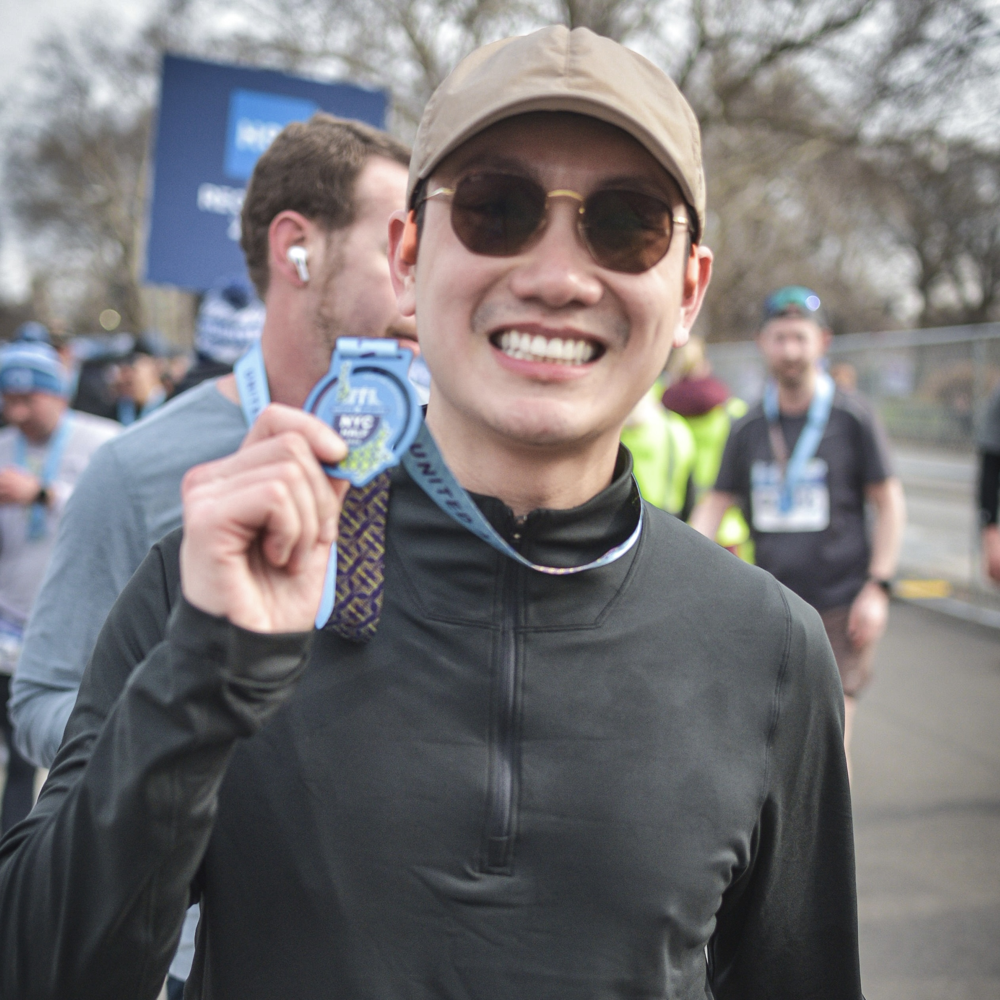

[Home](index.md) | [Research](research.md) | [Projects](projects.md) | [Resume](resume.pdf) | [LinkedIn](https://www.linkedin.com/in/huyle1625) | [GitHub](https://github.com/lehuypitt)
# Huy Le

PhD candidate in Statistics at the University of Pittsburgh. Dissertation defended; degree expected August 2026.

My academic background began in mathematics at Oregon State University, where I earned my B.S. in Mathematics with a minor in Actuarial Science. I then completed an M.A. in Statistics at the University of California, Berkeley before beginning my PhD in Statistics at the University of Pittsburgh.

My work focuses on Bayesian modeling, empirical Bayes, high-dimensional inference, spatial dependence, simulation studies, and scalable statistical computation. I am interested in quantitative research, data science, machine learning, time series, optimization, and applied statistical modeling.

## Selected Work

- Bayesian spatiotemporal modeling for longitudinal high-dimensional data
- Spatial empirical Bayes modeling for heterogeneous correlated data
- Spatial risk forecasting and route optimization
- Adaptive rejection sampling R package

## Links

- [Resume](resume.pdf)
- [Research](research.md)
- [Projects](projects.md)
- [LinkedIn](https://www.linkedin.com/in/huyle1625)
- [GitHub](https://github.com/lehuypitt)

## Personal

Outside of statistics, I enjoy distance running and traveling. I am currently training for the 2026 New York City Marathon with Team Autism Research through the Organization for Autism Research. This cause is personally meaningful to me because I care deeply about increasing awareness of autism and its impact on individuals, families, and communities.

If you are also running NYC in 2026, feel free to say hi — I would love to connect.

- [Support my NYC Marathon fundraiser for the Organization for Autism Research](https://support.researchautism.org/2026NYC/hhl1625)

---

Contact: [hhl9@pitt.edu](mailto:hhl9@pitt.edu) 
